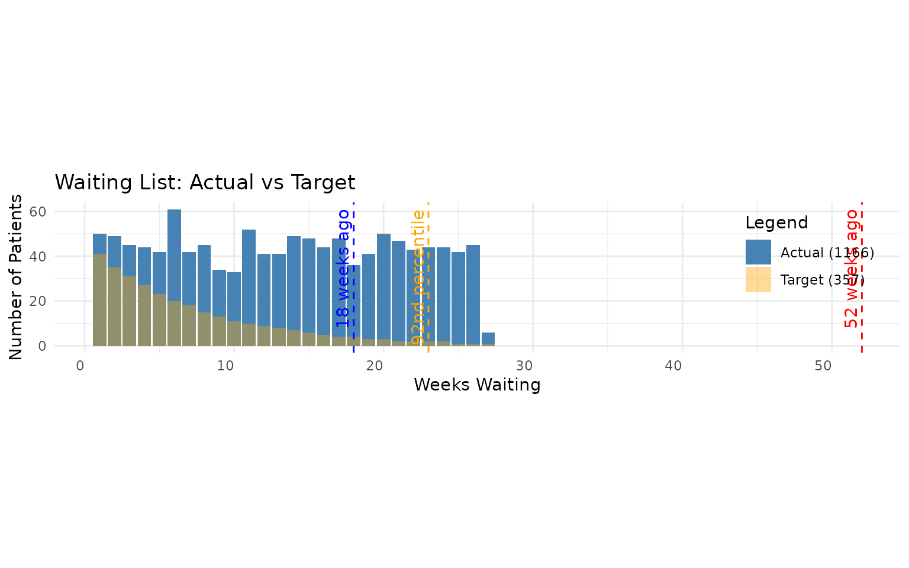

# Walkthrough of Histogram Waiting List Functions

``` r

library(NHSRwaitinglist)
library(dplyr, warn.conflicts = FALSE)
library(ggplot2)

set.seed(42)
```

This vignette is a worked example of the histogram workflow in
{NHSRwaitinglist}. It follows the same style as the other package
walkthroughs: start from simulated data, then work through each function
and interpret the outputs.

The walkthrough covers all histogram functions and helpers:

- [`format_histogram()`](https://nhs-r-community.github.io/NHSRwaitinglist/reference/format_histogram.md)
- [`aggregate_histogram()`](https://nhs-r-community.github.io/NHSRwaitinglist/reference/aggregate_histogram.md)
- [`sim_exponential_histogram()`](https://nhs-r-community.github.io/NHSRwaitinglist/reference/sim_exponential_histogram.md)
- [`wl_queue_size_hist()`](https://nhs-r-community.github.io/NHSRwaitinglist/reference/wl_queue_size_hist.md)
- [`wl_referral_stats_hist()`](https://nhs-r-community.github.io/NHSRwaitinglist/reference/wl_referral_stats_hist.md)
- [`wl_removal_stats_hist()`](https://nhs-r-community.github.io/NHSRwaitinglist/reference/wl_removal_stats_hist.md)
- [`wl_mean_wait_age_hist()`](https://nhs-r-community.github.io/NHSRwaitinglist/reference/wl_mean_wait_age_hist.md)
- [`wl_percentile_hist()`](https://nhs-r-community.github.io/NHSRwaitinglist/reference/wl_percentile_hist.md)
- [`wl_stats_hist()`](https://nhs-r-community.github.io/NHSRwaitinglist/reference/wl_stats_hist.md)
- [`vis_plot_hist()`](https://nhs-r-community.github.io/NHSRwaitinglist/reference/vis_plot_hist.md)
- [`wl_join_hist()`](https://nhs-r-community.github.io/NHSRwaitinglist/reference/wl_join_hist.md)
- [`wl_insert_hist()`](https://nhs-r-community.github.io/NHSRwaitinglist/reference/wl_insert_hist.md)

## Why histogram data?

Histogram data is often what we have available in operational practice:
counts in waiting-time bands, rather than one row per patient. This is
especially useful when patient-level data is unavailable, too large, or
must remain anonymised.

In this vignette we use weekly bins, then show how to estimate queue
size, demand, capacity, waiting times, and pressure from those bins.

## 1. Build a deterministic simulated waiting list

[Back to top…](#)

We start with simulated patient-level data, then convert snapshots into
histogram bins.

``` r

waiting_list <- wl_simulator(
  start_date = "2023-01-01",
  end_date = "2024-06-30",
  demand = 45,
  capacity = 30,
  detailed_sim = FALSE
)

# Add a deterministic category so we can demonstrate aggregation later
waiting_list <- waiting_list |>
  mutate(
    specialty = if_else(as.integer(Referral) %% 2 == 0, "Cardiology", "Orthopedics")
  )

head(waiting_list)
#>     Referral    Removal   specialty
#> 1 2023-01-01 2023-01-02  Cardiology
#> 2 2023-01-01 2023-01-02  Cardiology
#> 3 2023-01-01 2023-01-02  Cardiology
#> 4 2023-01-01 2023-01-02  Cardiology
#> 5 2023-01-02 2023-01-03 Orthopedics
#> 6 2023-01-02 2023-01-03 Orthopedics
```

Now define a helper to convert a snapshot date into a histogram with
stable weekly referral cohorts.

``` r

make_hist_weekly <- function(wl, snapshot_date) {
  snapshot_date <- as.Date(snapshot_date)

  waiting_at_snapshot <- wl |>
    filter(
      Referral <= snapshot_date,
      is.na(Removal) | Removal > snapshot_date
    )

  # Keep referral cohorts fixed to calendar weeks (Mon-Sun)
  waiting_binned <- waiting_at_snapshot |>
    mutate(
      arrival_since = Referral - (as.integer(strftime(Referral, "%u")) - 1),
      arrival_before = arrival_since + 6
    ) |>
    group_by(specialty, arrival_since, arrival_before) |>
    summarise(n = n(), .groups = "drop") |>
    mutate(report_date = snapshot_date)

  waiting_binned
}
```

Create weekly snapshots so we can estimate both demand and removals from
histogram data.

``` r

report_dates <- seq(as.Date("2024-03-31"), as.Date("2024-05-26"), by = "1 week")

hist_three_snapshots <- bind_rows(lapply(report_dates, function(d) {
  make_hist_weekly(waiting_list, d)
}))

unique(hist_three_snapshots$report_date)
#> [1] "2024-03-31" "2024-04-07" "2024-04-14" "2024-04-21" "2024-04-28"
#> [6] "2024-05-05" "2024-05-12" "2024-05-19" "2024-05-26"
```

## 2. Prepare histogram structure

[Back to top…](#)

[`format_histogram()`](https://nhs-r-community.github.io/NHSRwaitinglist/reference/format_histogram.md)
standardises date columns and ordering.

``` r

# Keep specialty while formatting each snapshot
first_report_date <- min(hist_three_snapshots$report_date)
hist_first <- hist_three_snapshots |>
  filter(report_date == first_report_date)

hist_mar_fmt <- format_histogram(
  hist_first,
  group_columns = "specialty",
  end_date = "2024-04-01"
)

head(hist_mar_fmt)
#>   arrival_since arrival_before  specialty  n report_date
#> 1    2024-03-25     2024-03-31 Cardiology 16  2024-03-31
#> 2    2024-03-18     2024-03-24 Cardiology 18  2024-03-31
#> 3    2024-03-11     2024-03-17 Cardiology 23  2024-03-31
#> 4    2024-03-04     2024-03-10 Cardiology 16  2024-03-31
#> 5    2024-02-26     2024-03-03 Cardiology 18  2024-03-31
#> 6    2024-02-19     2024-02-25 Cardiology 26  2024-03-31
```

[`aggregate_histogram()`](https://nhs-r-community.github.io/NHSRwaitinglist/reference/aggregate_histogram.md)
removes categorical splits (unless requested) and sums counts.

``` r

# Collapse specialties into one total queue
hist_mar_total <- aggregate_histogram(hist_mar_fmt)

head(hist_mar_total)
#> # A tibble: 6 × 3
#>   arrival_since arrival_before     n
#>   <date>        <date>         <int>
#> 1 2023-10-16    2023-10-22        12
#> 2 2023-10-23    2023-10-29        56
#> 3 2023-10-30    2023-11-05        38
#> 4 2023-11-06    2023-11-12        45
#> 5 2023-11-13    2023-11-19        51
#> 6 2023-11-20    2023-11-26        44
```

We can also keep categories while aggregating.

``` r

hist_mar_by_specialty <- aggregate_histogram(
  hist_mar_fmt,
  group_columns = "specialty"
)

head(hist_mar_by_specialty)
#> # A tibble: 6 × 4
#>   arrival_since arrival_before specialty       n
#>   <date>        <date>         <chr>       <int>
#> 1 2023-10-16    2023-10-22     Cardiology     10
#> 2 2023-10-16    2023-10-22     Orthopedics     2
#> 3 2023-10-23    2023-10-29     Cardiology     23
#> 4 2023-10-23    2023-10-29     Orthopedics    33
#> 5 2023-10-30    2023-11-05     Cardiology     25
#> 6 2023-10-30    2023-11-05     Orthopedics    13
```

## 3. Create a second synthetic histogram example

[Back to top…](#)

[`sim_exponential_histogram()`](https://nhs-r-community.github.io/NHSRwaitinglist/reference/sim_exponential_histogram.md)
is useful when you want a clean deterministic example for testing and
teaching.

``` r

synthetic_hist <- sim_exponential_histogram(
  num_intervals = 18,
  end_date = as.Date("2024-05-31"),
  rate = 0.12,
  queue_size = 650,
  time_interval = "weeks",
  random = FALSE
) |>
  mutate(report_date = as.Date("2024-05-31"))

head(synthetic_hist)
#>   arrival_since arrival_before  n report_date
#> 1    2024-05-31     2024-05-30 74  2024-05-31
#> 2    2024-05-24     2024-05-30 66  2024-05-31
#> 3    2024-05-17     2024-05-23 58  2024-05-31
#> 4    2024-05-10     2024-05-16 52  2024-05-31
#> 5    2024-05-03     2024-05-09 46  2024-05-31
#> 6    2024-04-26     2024-05-02 41  2024-05-31
```

## 4. Single-snapshot metrics

[Back to top…](#)

For single-snapshot metrics we use the latest report date in our weekly
series.

``` r

latest_report_date <- max(hist_three_snapshots$report_date)

hist_may_total <- hist_three_snapshots |>
  filter(report_date == latest_report_date) |>
  aggregate_histogram(group_columns = "report_date")

head(hist_may_total)
#> # A tibble: 6 × 4
#>   arrival_since arrival_before report_date     n
#>   <date>        <date>         <date>      <int>
#> 1 2023-11-20    2023-11-26     2024-05-26      6
#> 2 2023-11-27    2023-12-03     2024-05-26     45
#> 3 2023-12-04    2023-12-10     2024-05-26     42
#> 4 2023-12-11    2023-12-17     2024-05-26     44
#> 5 2023-12-18    2023-12-24     2024-05-26     44
#> 6 2023-12-25    2023-12-31     2024-05-26     43
```

### Queue size

``` r

queue_size_may <- wl_queue_size_hist(hist_may_total)
queue_size_may
#> [1] 1166
```

The total queue size in this snapshot is 1166 patients waiting.

### Mean waiting age

``` r

mean_wait_age_days <- wl_mean_wait_age_hist(hist_may_total)
mean_wait_age_days
#> [1] 90.50172
```

The average waiting age is 90.5 days.

### Percentiles

``` r

p92 <- wl_percentile_hist(hist_may_total, percentage = 92)
p50 <- wl_percentile_hist(hist_may_total, percentage = 50)

p92
#> $date_percentile
#> [1] "2023-12-18"
#> 
#> $weeks_percentile
#> [1] 23
#> 
#> $date
#> [1] "2023-12-18"
#> 
#> $weeks
#> [1] 23
#> 
#> $percentage
#> [1] 92
p50
#> $date_percentile
#> [1] "2024-02-20"
#> 
#> $weeks_percentile
#> [1] 14
#> 
#> $date
#> [1] "2024-02-20"
#> 
#> $weeks
#> [1] 14
#> 
#> $percentage
#> [1] 50
```

The median wait is approximately 14 weeks, and the 92nd percentile wait
is approximately 23 weeks.

## 5. Multi-snapshot demand and capacity metrics

[Back to top…](#)

[`wl_referral_stats_hist()`](https://nhs-r-community.github.io/NHSRwaitinglist/reference/wl_referral_stats_hist.md)
and
[`wl_removal_stats_hist()`](https://nhs-r-community.github.io/NHSRwaitinglist/reference/wl_removal_stats_hist.md)
use report dates differently:

- referral stats are inferred from the latest histogram intervals
- removal stats compare at least two snapshots over time

``` r

hist_all_total <- hist_three_snapshots |>
  aggregate_histogram(group_columns = "report_date")

referral_stats <- wl_referral_stats_hist(hist_all_total)
removal_stats <- wl_removal_stats_hist(hist_all_total)

referral_stats
#>   demand_weekly demand_daily demand_cov demand_count
#> 1            50     7.142857          1           50
removal_stats
#>   capacity_weekly capacity_daily capacity_cov removal_count
#> 1              30       4.285714            1           240
```

From this simulation, the estimated demand is 50 per week, and estimated
capacity is 30 per week.

## 6. Complete summary with wl_stats_hist()

[Back to top…](#)

Now compute all key measures in one call.

``` r

overall_hist_stats <- wl_stats_hist(
  hist_all_total,
  target_wait = 18
)

overall_hist_stats
#>   mean_demand mean_capacity     load load_too_big count_demand queue_size
#> 1          50            30 1.666667         TRUE           50       1166
#>   target_queue_size queue_too_big mean_wait_age mean_wait cv_arrival cv_removal
#> 1          357.1429          TRUE      90.50172  90.50172          1          1
#>   target_capacity relief_capacity pressure
#> 1              NA        81.10989 10.05575
```

For readability, here are selected columns.

| mean_demand | mean_capacity | load | queue_size | target_queue_size | queue_too_big | mean_wait_age | pressure | target_capacity | relief_capacity |
|:--:|:--:|:--:|:--:|:--:|:--:|:--:|:--:|:--:|:--:|
| 50 | 30 | 1.67 | 1166 | 357.14 | TRUE | 90.5 | 10.06 | NA | 81.11 |

Interpretation:

- `load >= 1` indicates unstable demand/capacity balance
- `queue_too_big = TRUE` suggests recovery capacity may be needed
- higher `pressure` indicates greater risk of missing the waiting-time
  target

## 7. Plot actual histogram against geometric target

[Back to top…](#)

[`vis_plot_hist()`](https://nhs-r-community.github.io/NHSRwaitinglist/reference/vis_plot_hist.md)
overlays the observed histogram with a target distribution.

``` r

vis_plot_hist(
  wl_hist = hist_may_total,
  target = 18,
  percentage = 92
)
```



This chart helps compare the current queue shape with the target profile
implied by the waiting standard.

## 8. Joining and inserting histograms

[Back to top…](#)

These helpers combine histogram datasets. On histogram inputs,
[`wl_insert_hist()`](https://nhs-r-community.github.io/NHSRwaitinglist/reference/wl_insert_hist.md)
is equivalent to
[`wl_join_hist()`](https://nhs-r-community.github.io/NHSRwaitinglist/reference/wl_join_hist.md).

``` r

base_hist <- hist_may_total

# Synthetic additions in very recent bins
additions <- data.frame(
  arrival_since = as.Date(c("2024-05-13", "2024-05-20")),
  arrival_before = as.Date(c("2024-05-19", "2024-05-26")),
  n = c(12, 9),
  report_date = latest_report_date
)

joined_hist <- wl_join_hist(base_hist, additions)
inserted_hist <- wl_insert_hist(base_hist, additions)

queue_size_base <- wl_queue_size_hist(base_hist)
queue_size_joined <- wl_queue_size_hist(joined_hist)
queue_size_inserted <- wl_queue_size_hist(inserted_hist)

data.frame(
  base = queue_size_base,
  joined = queue_size_joined,
  inserted = queue_size_inserted
)
#>   base joined inserted
#> 1 1166   1187     1187
```

Both combined outputs increase the queue by the same number of additions
in this example.

## 9. Practical checks and pitfalls

[Back to top…](#)

When working with histogram functions:

1.  Keep `report_date` present and correctly typed as Date.
2.  Use at least two unique report dates when calling
    [`wl_removal_stats_hist()`](https://nhs-r-community.github.io/NHSRwaitinglist/reference/wl_removal_stats_hist.md)
    and
    [`wl_stats_hist()`](https://nhs-r-community.github.io/NHSRwaitinglist/reference/wl_stats_hist.md).
3.  Keep bin width consistent (for example, always 1 week) across
    snapshots.
4.  Confirm total counts after aggregation and joins to avoid accidental
    double-counting.
5.  Treat percentile and pressure values as approximations because they
    are inferred from bins.

## Summary

This vignette walked through a complete histogram workflow:

- simulated data and binned into weekly intervals
- formatted and aggregated histograms
- computed single-snapshot queue and wait metrics
- estimated demand/capacity from multiple snapshots
- produced full waiting-list summary metrics
- visualised actual versus target shape
- combined histograms with join/insert helpers

## Further reading

- For patient-level workflows, see [Walkthrough of waiting list
  functions](https://nhs-r-community.github.io/NHSRwaitinglist/articles/example_walkthrough.md)
- For three contrasted queue behaviours, see [Three example waiting
  lists](https://nhs-r-community.github.io/NHSRwaitinglist/articles/three_example_waiting_lists.md)
- For simulation-heavy exploration, see [Simulating waiting
  lists](https://nhs-r-community.github.io/NHSRwaitinglist/articles/waiting_list_sim.md)

------------------------------------------------------------------------

END
